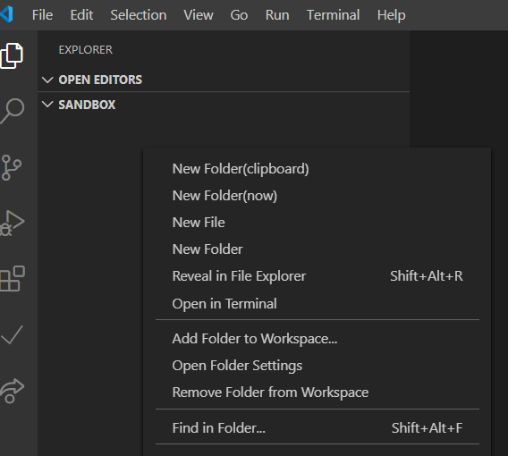
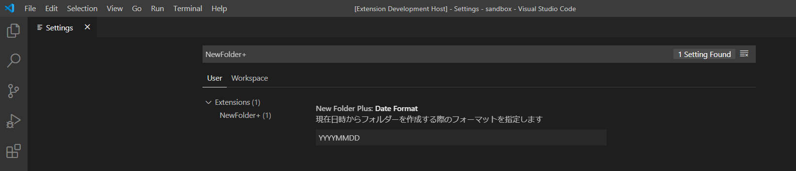

# New Folder+
エクスプローラーのコンテキストメニューを拡張します

## コンテキストメニュー

- New Folder(now)
  - 現在日時からフォルダーを作成します
- New Folder(clipboard)
  - クリップボードの内容からフォルダーを作成します
  - クリップボードの内容が文字列である場合フォルダーを作成できます

## 設定

- Date Format
  - 利用可能なフォーマットは [moment](https://momentjs.com/docs/#/displaying/) を参照してください
